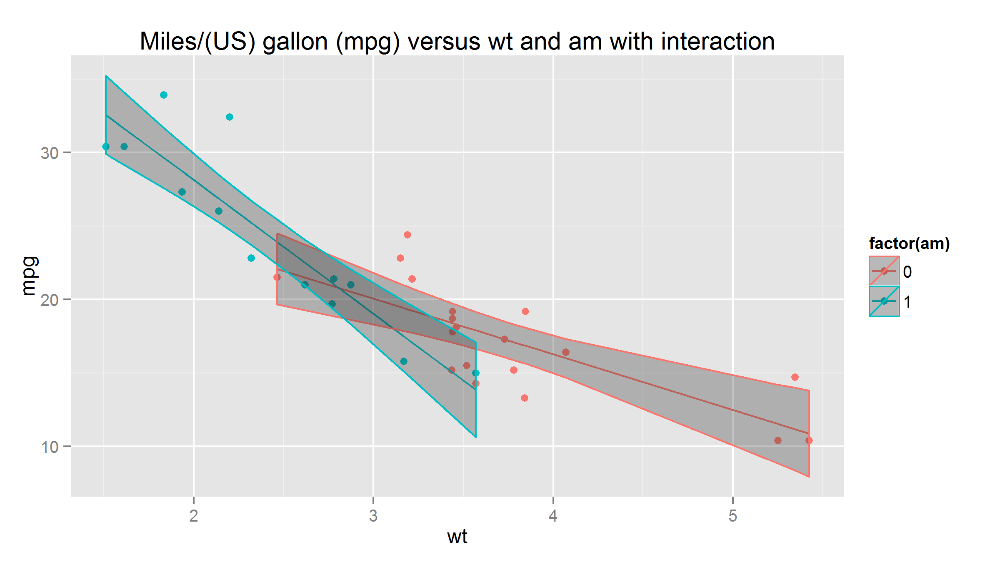

MPG regression of mtcars data visualization tool
========================================================

author: llangevin  
date: January 2016

Developing Data Product Course Project:
========================================================
## MPG regression of mtcars data visualization tool:  

An Shiny interactive visualization tool to help the students from the Regression Models Course in their final project.  
  
They are interested in exploring the relationship between a set of variables (mtcars data) and miles per gallon (MPG) (outcome).  
  
This tool will help them in their exploratory data analyses, allow them to fit multiple models and help them detail their strategy for model selection.

Features:
========================================================
-From the Motor Trend Car Road Tests (mtcars) datasets obtain  
  - A scatter plot of Miles/(US) gallon (mpg) versus any continuous variable.  
  - The fitted regression (lm) line in the plot.  
  - Add any factor variable in the model
  - The possibility to add an interaction term in the model between the continuous and factor variable.  
  - The 95% confidence interval for every fitted line.  
  - A summary ANOVA table of the selected model.

A sample:
========================================================

Try it!
========================================================
Link to the shinyapps.io web page:  

- http://llangevin.shinyapps.io/mtcarsplot5  

Link to the documentation where you can find the ui.R, server.R and Readme.md files:  

- https://github.com/llangevin/Developing_Data_Products.git
